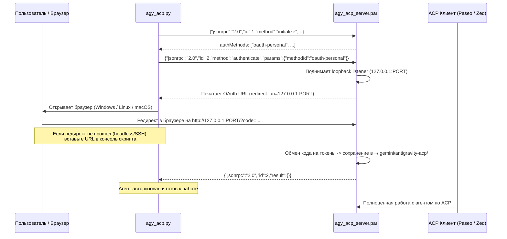

# Google Antigravity ACP Manager

Универсальный инструмент для загрузки, авторизации и управления сервером **Google Antigravity ACP** (`agy_acp_server`) по открытому протоколу [Agent Client Protocol](https://agentclientprotocol.com).

Репозиторий решает ключевые задачи:
- 📦 **Авто-загрузка и обновления**: динамическое получение актуальных бинарников из [официального ACP Registry](https://cdn.agentclientprotocol.com/registry/v1/latest/registry.json) под Linux (x86_64 / ARM64), macOS и Windows.
- 🔐 **Headless / WSL2 OAuth2**: бесшовное прохождение Google OAuth авторизации через JSON-RPC по stdio с авто-перехватом браузера в WSL2 и поддержкой ручного ввода ссылки редиректа для удаленных/SSH сессий.
- 🔌 **Интеграция с любыми клиентами**: готовая поддержка [Paseo](https://getpaseo.com), [Zed](https://zed.dev), Cursor и любых ACP-совместимых сред.

---

## 🚀 Быстрый старт (ACP Сервер)

```bash
git clone https://github.com/Kzamirtay/antigravity-acp.git ~/.local/share/antigravity-acp
cd ~/.local/share/antigravity-acp
./setup.sh
```

Команда `./setup.sh` (или `./setup.sh setup`) выполнит:
1. Проверку наличия установленного Google Antigravity CLI (`agy`).
2. Запрос к **ACP Registry** и скачивание актуального релиза `agy_acp_server` под вашу ОС и архитектуру.
3. Авторизацию в Google через протокол ACP (JSON-RPC stdio).
4. Проверку готовности агента.

После этого сервер Antigravity полностью готов к работе с любым ACP-клиентом!

---

## 🧭 Команды CLI (`./setup.sh` / `agy_acp.py`)

Инструмент написан на чистом **Python 3** без внешних `pip`-зависимостей.

| Команда | Назначение |
|---|---|
| `./setup.sh` (или `setup`) | **Базовый сетап ACP**: проверка `agy` + скачивание из реестра + Google OAuth + проверка |
| `./setup.sh check-agy` | Проверка наличия и версии Google Antigravity CLI (`agy`) |
| `./setup.sh status` | Проверка `agy`, реестра, наличия обновлений, локального файла и OAuth-токена |
| `./setup.sh install [--force]` | Загрузка и распаковка актуального релиза из ACP Registry |
| `./setup.sh auth [--force]` | Запуск только процесса авторизации (OAuth JSON-RPC) |
| `./setup.sh run [args...]` | Прямой запуск ACP сервера по `stdio` (для вызова редакторами/агентами) |
| **`./setup.sh paseo`** | **Интеграция с Paseo**: авто-запись провайдера в `~/.paseo/config.json` и `paseo reload` |

---

## 🎯 Подключение к Paseo (отдельная команда)

Для регистрации провайдера Antigravity в платформе [Paseo](https://getpaseo.com) выполните:

```bash
./setup.sh paseo
```

Команда автоматически:
1. Создаст резервную копию `~/.paseo/config.json.bak`.
2. Добавит секцию `antigravity` в `agents.providers`:
   ```json
   "antigravity": {
     "extends": "acp",
     "label": "Antigravity",
     "command": [
       "/home/<USER>/.local/share/antigravity-acp/agy_acp_server.par"
     ],
     "params": {
       "supportsMcpServers": false
     }
   }
   ```
3. Перезагрузит конфигурацию демона через `paseo reload` и выведет статус:
   ```text
   PROVIDER      LABEL         STATUS     ENABLED   DEFAULT MODE   MODES
   antigravity   Antigravity   available  Enabled   default        Default, Auto Edit, YOLO
   ```

*Флаг `--use-registry-args` (или `--use-uid`) опционально добавляет рекомендованные реестром аргументы (например, `--uid=`).*

---

## 🛠 Подключение к другим ACP-клиентам (Zed, Cursor и др.)

Вы можете использовать скомпилированный бинарник напрямую или запускать его через скрипт:

- **Прямой бинарник**:
  `~/.local/share/antigravity-acp/agy_acp_server.par`
- **Через CLI-раннер**:
  `~/.local/share/antigravity-acp/setup.sh run`

---

## 💡 Как устроен процесс авторизации

`agy_acp_server.par` работает как ACP-агент через стандартные потоки ввода/вывода (`stdin`/`stdout`).



### Трюк с headless / WSL2 / SSH-логином
1. Сервер поднимает локальный HTTP-листенер на случайном свободном порту (`http://127.0.0.1:<PORT>/`) для приема OAuth2 коллбека.
2. Скрипт перехватывает сгенерированный URL авторизации Google.
3. В **WSL2** скрипт автоматически вызывает `powershell.exe Start-Process` для запуска браузера на хосте Windows. Благодаря mirrored-сети WSL2 запрос на `127.0.0.1:<PORT>` бесшовно возвращается обратно в листенер WSL2.
4. В **Headless/SSH** окружении (или если порт не проброшен):
   - Откройте сгенерированную ссылку в любом браузере на любом устройстве.
   - Завершите вход в Google.
   - Браузер выполнит редирект на `http://localhost:<PORT>/?state=...&code=...` (страница покажет ошибку соединения — это нормально).
   - Скопируйте финальный URL из адресной строки браузера и вставьте его в терминал скрипта (или запишите в `callback_url.txt`).
   - Скрипт мгновенно отправит HTTP GET на локальный листенер, и авторизация завершится успехом.

---

## 📖 Ручной JSON-RPC протокол (для отладки)

Вы можете взаимодействовать с сервером напрямую без вспомогательных скриптов:

1. Запуск сервера:
   ```bash
   ./agy_acp_server.par
   ```
2. Подача `initialize` в stdin:
   ```json
   {"jsonrpc": "2.0", "id": 1, "method": "initialize", "params": {"protocolVersion": 1}}
   ```
3. Подача `authenticate` в stdin:
   ```json
   {"jsonrpc": "2.0", "id": 2, "method": "authenticate", "params": {"methodId": "oauth-personal"}}
   ```
4. В `stderr` отобразится ссылка вида:
   ```text
   Open the following link to authenticate the ACP server: https://accounts.google.com/o/oauth2/v2/auth?...&redirect_uri=http%3A%2F%2F127.0.0.1%3A<PORT>%2F&...
   ```
5. Доставка коллбека вручную через curl (при необходимости):
   ```bash
   curl "http://127.0.0.1:<PORT>/?state=...&code=..."
   ```

---

## 📄 Лицензия

MIT License
