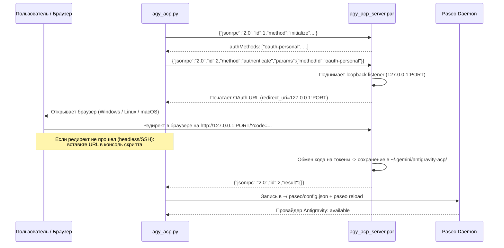

# Google Antigravity ACP Integration for Paseo

Автоматизация интеграции Google Antigravity ACP сервера (`agy_acp_server.par`) с платформой агентов [Paseo](https://getpaseo.com). Включает установку, решение headless/WSL2 OAuth авторизации через JSON-RPC по stdio и настройку конфигурации Paseo.

---

## 🚀 Быстрый старт

```bash
git clone https://github.com/Kzamirtay/antigravity-acp.git ~/.local/share/antigravity-acp
cd ~/.local/share/antigravity-acp
./setup.sh
```

Команда `./setup.sh` выполнит полный цикл в интерактивном режиме:
1. **Проверка/загрузка** актуального бинарника `agy_acp_server` напрямую из [официального ACP Registry](https://cdn.agentclientprotocol.com/registry/v1/latest/registry.json) под вашу платформу (Linux x86_64/ARM64, macOS, Windows).
2. **Аутентификация** через протокол ACP (JSON-RPC stdio) с авто-открытием браузера (поддерживает WSL2, Linux, macOS и ручной headless/SSH ввод).
3. **Настройка Paseo** (`~/.paseo/config.json`) и перезагрузка демона.
4. **Проверка статуса** доступности агента в `paseo provider ls` и проверка обновлений в реестре.

---

## 💡 Как устроен процесс авторизации

`agy_acp_server.par` работает как ACP-агент (Agent Client Protocol) через стандартные потоки ввода/вывода (`stdin`/`stdout`).



### Трюк с headless / WSL2 / SSH-логином
1. Сервер поднимает локальный HTTP-листенер на случайном свободном порту (`http://127.0.0.1:<PORT>/`) для приема OAuth2 коллбека.
2. Скрипт перехватывает сгенерированный URL авторизации Google.
3. В **WSL2** скрипт автоматически вызывает `powershell.exe Start-Process` для запуска браузера на хосте Windows. Благодаря mirrored-сети WSL2 запрос на `127.0.0.1:<PORT>` бесшовно возвращается обратно в листенер WSL2.
4. В **Headless/SSH** окружении (или если порт не проброшен):
   - Откройте сгенерированную ссылку в любом браузере на любом устройстве.
   - Завершите вход в Google.
   - Браузер выполнит редирект на `http://localhost:<PORT>/?state=...&code=...` (страница покажет ошибку соединения — это ожидаемо).
   - Скопируйте финальный URL из адресной строки браузера и вставьте его в терминал скрипта (или запишите в `callback_url.txt`).
   - Скрипт мгновенно отправит HTTP GET на локальный листенер, и авторизация завершится успехом.

---

## 🛠 Команды CLI (`agy_acp.py` / `setup.sh`)

Скрипт написан на **чистом Python 3** с использованием только стандартной библиотеки — никаких сторонних `pip`-зависимостей не требуется.

| Команда | Описание |
|---|---|
| `./setup.sh` или `./agy_acp.py setup` | Полный цикл: скачивание из реестра + логин + конфиг + проверка |
| `./setup.sh status` | Проверка реестра, наличия обновлений, валидности токенов и статуса Paseo |
| `./setup.sh install [--force]` | Скачивание и установка актуального релиза из официального ACP Registry |
| `./setup.sh auth [--force]` | Запуск только процесса OAuth-авторизации |
| `./setup.sh config [--use-registry-args]` | Запись настроек в `~/.paseo/config.json` (с флагами из реестра) и `paseo reload` |

---

## ⚙️ Ручная настройка конфигурации Paseo

Если вы предпочитаете сконфигурировать `~/.paseo/config.json` вручную, добавьте провайдера в секцию `agents.providers`:

```json
{
  "agents": {
    "providers": {
      "antigravity": {
        "extends": "acp",
        "label": "Antigravity",
        "command": [
          "/home/<USER>/.local/share/antigravity-acp/agy_acp_server.par"
        ],
        "params": {
          "supportsMcpServers": false
        }
      }
    }
  }
}
```

После редактирования перезагрузите демон Paseo:
```bash
paseo reload
paseo provider ls
```

Ожидаемый вывод:
```text
PROVIDER      LABEL             STATUS        ENABLED     DEFAULT MODE    MODES
antigravity   Antigravity       available     Enabled     default         Default, Auto Edit, YOLO
```

---

## 📖 Ручной JSON-RPC протокол (для отладки)

Вы можете взаимодействовать с сервером напрямую без вспомогательных скриптов:

1. Запуск сервера:
   ```bash
   ./agy_acp_server.par
   ```
2. Подача `initialize` в stdin:
   ```json
   {"jsonrpc": "2.0", "id": 1, "method": "initialize", "params": {"protocolVersion": 1}}
   ```
3. Подача `authenticate` в stdin:
   ```json
   {"jsonrpc": "2.0", "id": 2, "method": "authenticate", "params": {"methodId": "oauth-personal"}}
   ```
4. В `stderr` отобразится ссылка вида:
   ```text
   Open the following link to authenticate the ACP server: https://accounts.google.com/o/oauth2/v2/auth?...&redirect_uri=http%3A%2F%2F127.0.0.1%3A<PORT>%2F&...
   ```
5. Доставка коллбека вручную через curl (при необходимости):
   ```bash
   curl "http://127.0.0.1:<PORT>/?state=...&code=..."
   ```

---

## 📄 Лицензия

MIT License
