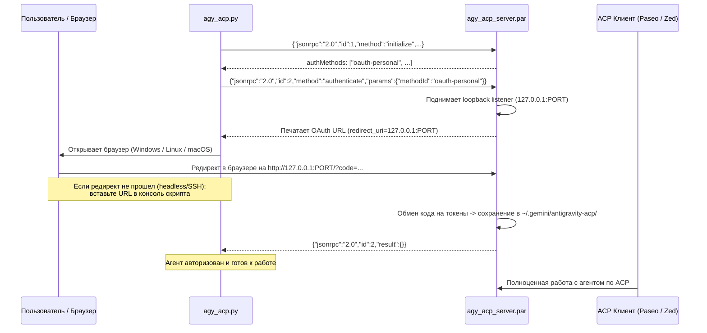

# Google Antigravity ACP Manager

Универсальный инструмент для загрузки, авторизации и управления сервером **Google Antigravity ACP** (`agy_acp_server`) по открытому протоколу [Agent Client Protocol](https://agentclientprotocol.com).

Репозиторий решает ключевые задачи:
- 📦 **Авто-загрузка и обновления**: динамическое получение актуальных бинарников из [официального ACP Registry](https://cdn.agentclientprotocol.com/registry/v1/latest/registry.json) под Linux (x86_64 / ARM64), macOS и Windows.
- 🔐 **Headless / WSL2 OAuth2**: бесшовное прохождение Google OAuth авторизации через JSON-RPC по stdio с авто-перехватом браузера в WSL2 и поддержкой ручного ввода ссылки редиректа для удаленных/SSH сессий.
- 👁️ **Прозрачный ACP-мост (Bridge)**: перехват и обогащение событий ACP (`acp_bridge.py`) — чтение и подстановка реального содержимого файлов (`read`), нормализация полей (`filePath`, `line`, `limit`), формирование diff для правок (`edit`) и отображение команд (`execute`).
- 🔌 **Интеграция с любыми клиентами**: готовая поддержка [Paseo](https://getpaseo.com), [Zed](https://zed.dev), Cursor и любых ACP-совместимых сред.

---

## 💻 Режимы работы: Linux (`setup.sh`) и Windows (`setup.ps1`)

Репозиторий четко разделен на две поддерживаемые платформы:

```
       ┌─────────────────────────────────────────────────────────┐
       │             Google Antigravity ACP Manager              │
       └────────────────────────────┬────────────────────────────┘
                                    │
           ┌────────────────────────┴────────────────────────┐
           ▼                                                 ▼
  🐧 Linux / WSL                                    🪟 Windows (PowerShell)
  • Скрипт: ./setup.sh                              • Скрипт: .\setup.ps1
  • Бинарник: agy_acp_server.par                    • Бинарник: agy_acp_server.exe
  • Раннер: run_acp.sh                              • Мост: acp_bridge.py
  • Конфиг: ~/.paseo/config.json                    • Конфиг: %USERPROFILE%\.paseo\config.json
```

---

## 🚀 Быстрый старт

### 🐧 Для Linux / WSL:
```bash
git clone https://github.com/Kzamirtay/antigravity-acp.git ~/.local/share/antigravity-acp
cd ~/.local/share/antigravity-acp
./setup.sh
```

### 🪟 Для Windows (PowerShell):
```powershell
git clone https://github.com/Kzamirtay/antigravity-acp.git C:\antigravity-acp
cd C:\antigravity-acp
powershell -ExecutionPolicy Bypass -File .\setup.ps1
```

Команда автоматически:
1. Проверит наличие Google Antigravity CLI (`agy`).
2. Скачает актуальный релиз сервера (`.par` для Linux или `.exe` для Windows) из официального ACP Registry.
3. Выполнит авторизацию через Google OAuth (JSON-RPC stdio).
4. Проверит статус готовности агента.

---

## 🧭 Команды

Инструмент написан на чистом **Python 3** (3.10+) без сторонних `pip`-зависимостей.

| Linux / WSL (`./setup.sh`) | Windows PowerShell (`.\setup.ps1`) | Назначение |
|---|---|---|
| `./setup.sh` | `.\setup.ps1` | **Полный сетап**: проверка `agy` + скачивание + Google OAuth + проверка |
| `./setup.sh paseo` | `.\setup.ps1 paseo` | **Интеграция с Paseo**: настройка конфига и моста, `paseo reload` |
| `./setup.sh status` | `.\setup.ps1 status` | Проверка `agy`, реестра, наличия обновлений, локального файла и OAuth |
| `./setup.sh install [--force]` | `.\setup.ps1 install [--force]` | Загрузка и распаковка актуального релиза из ACP Registry |
| `./setup.sh auth [--force]` | `.\setup.ps1 auth [--force]` | Запуск только процесса авторизации (OAuth JSON-RPC) |
| `./setup.sh check-agy` | `.\setup.ps1 check-agy` | Проверка наличия и версии Google Antigravity CLI (`agy`) |
| `./setup.sh run [args...]` | `.\setup.ps1 run [args...]` | Прямой запуск ACP сервера по `stdio` |

---

## 🎯 Подключение к Paseo

Для регистрации провайдера Antigravity в платформе [Paseo](https://getpaseo.com):

- В **Linux / WSL**:
  ```bash
  ./setup.sh paseo
  ```
- В **Windows PowerShell**:
  ```powershell
  .\setup.ps1 paseo
  ```

Скрипт автоматически:
1. Создаст резервную копию существующего `config.json.bak`.
2. Развернет `acp_bridge.py` в каталог `.paseo`.
3. Зарегистрирует секцию `antigravity` в `agents.providers`:
   - На **Linux**: запускает `/path/to/antigravity-acp/run_acp.sh`.
   - На **Windows**: запускает `python.exe -u %USERPROFILE%\.paseo\acp_bridge.py`.
4. Перезагрузит конфигурацию демона через `paseo reload`.

---

## 👁️ Умный ACP-мост (`acp_bridge.py`)

Сервер `agy_acp_server` по умолчанию отдает минимальные данные о действиях агента. Для Paseo и других клиентов мост прозрачно обогащает поток:
- **Read (`view_file`)**: Безопасно считывает срез строк файла с диска по `cwd` сессии и передает его в UI Paseo. В результате в блоке вызова отображается подсвеченный синтаксисом код и номера строк (вместо *"Дополнительные сведения отсутствуют"*).
- **Edit (`replace_file_content`) / Write (`write_to_file`)**: Формирует полноценный unified diff (`--- a/...`, `+++ b/...`, `@@`, `+`, `-`) через `difflib`. Интерфейс Paseo распознает изменения и отображает интерактивный цветной дифф с удаленными и добавленными строками (вместо *"Нет изменений для отображения"*).

---

## 🛠 Подключение к другим ACP-клиентам (Zed, Cursor и др.)

Вы можете использовать скомпилированный бинарник или раннер:

- **Linux / macOS**:
  - Прямой бинарник: `~/.local/share/antigravity-acp/agy_acp_server.par`
  - Через раннер с мостом: `~/.local/share/antigravity-acp/run_acp.sh`
- **Windows**:
  - Прямой бинарник: `C:\antigravity-acp\agy_acp_server.exe`
  - Через раннер с мостом: `python -u C:\antigravity-acp\acp_bridge.py`

## 💡 Как устроен процесс авторизации

`agy_acp_server.par` работает как ACP-агент через стандартные потоки ввода/вывода (`stdin`/`stdout`).



### Трюк с headless / WSL2 / SSH-логином
1. Сервер поднимает локальный HTTP-листенер на случайном свободном порту (`http://127.0.0.1:<PORT>/`) для приема OAuth2 коллбека.
2. Скрипт перехватывает сгенерированный URL авторизации Google.
3. В **WSL2** скрипт автоматически вызывает `powershell.exe Start-Process` для запуска браузера на хосте Windows. Благодаря mirrored-сети WSL2 запрос на `127.0.0.1:<PORT>` бесшовно возвращается обратно в листенер WSL2.
4. В **Headless/SSH** окружении (или если порт не проброшен):
   - Откройте сгенерированную ссылку в любом браузере на любом устройстве.
   - Завершите вход в Google.
   - Браузер выполнит редирект на `http://localhost:<PORT>/?state=...&code=...` (страница покажет ошибку соединения — это нормально).
   - Скопируйте финальный URL из адресной строки браузера и вставьте его в терминал скрипта (или запишите в `callback_url.txt`).
   - Скрипт мгновенно отправит HTTP GET на локальный листенер, и авторизация завершится успехом.

---

## 📖 Ручной JSON-RPC протокол (для отладки)

Вы можете взаимодействовать с сервером напрямую без вспомогательных скриптов:

1. Запуск сервера:
   ```bash
   ./agy_acp_server.par
   ```
2. Подача `initialize` в stdin:
   ```json
   {"jsonrpc": "2.0", "id": 1, "method": "initialize", "params": {"protocolVersion": 1}}
   ```
3. Подача `authenticate` в stdin:
   ```json
   {"jsonrpc": "2.0", "id": 2, "method": "authenticate", "params": {"methodId": "oauth-personal"}}
   ```
4. В `stderr` отобразится ссылка вида:
   ```text
   Open the following link to authenticate the ACP server: https://accounts.google.com/o/oauth2/v2/auth?...&redirect_uri=http%3A%2F%2F127.0.0.1%3A<PORT>%2F&...
   ```
5. Доставка коллбека вручную через curl (при необходимости):
   ```bash
   curl "http://127.0.0.1:<PORT>/?state=...&code=..."
   ```

---

## 📄 Лицензия

MIT License
